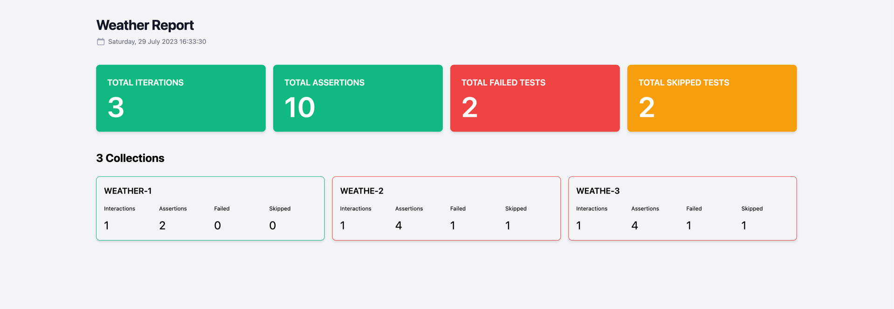

# postman-runner

Run multiple Postman collections with a single command.



## Configuration

- `config.yml` by default

```yaml
report:
  name: Weather Report
  filename: reporter/weather-report.html
  reporter: html
logger: true
commands:
  - name: collection-1
    command: newman run xxxx -e xxxx
  - name: collection-2
    command: newman run xxxx -e xxxx
```

** The `name` is unique, and there are no duplicates.

### Reporter options by collection

- newman

```shell
brew install newman
```

- newman-reporter-html (`html`)

```shell
npm install -g newman-reporter-html
```

- newman-reporter-htmlextra (`htmlextra`)

```shell
npm install -g newman-reporter-htmlextra
```

### Report HTML

```shell
➜  automate-api git:(master) ✗ 
├── config.yml
└── reporter
    ├── get-weather-1.html
    ├── get-weather-2.html
    ├── get-weather-3.html
    └── weather-report.html
```

## Install

### Install Rust

```shell
curl --proto '=https' --tlsv1.2 -sSf https://sh.rustup.rs | sh
```

### With Cargo Install

```shell
cargo install postman-runner --git https://github.com/prongbang/postman-runner.git
```

### With Cargo Build

```shell
cargo build --release
```

## Run

```shell
postman-runner --config config.yml
```
